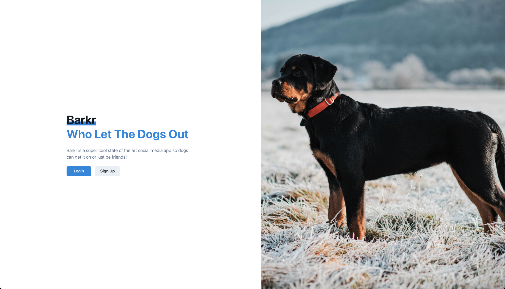
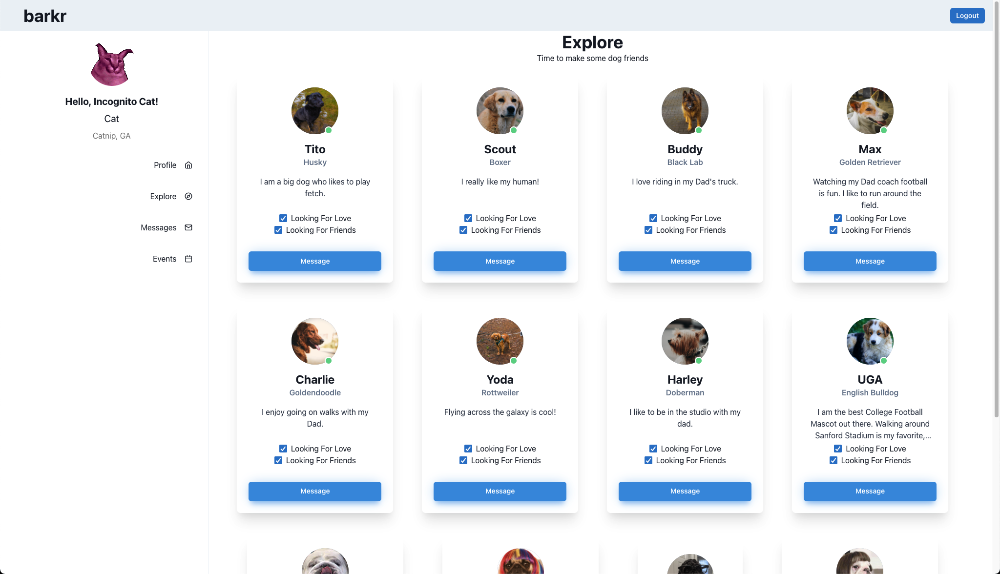
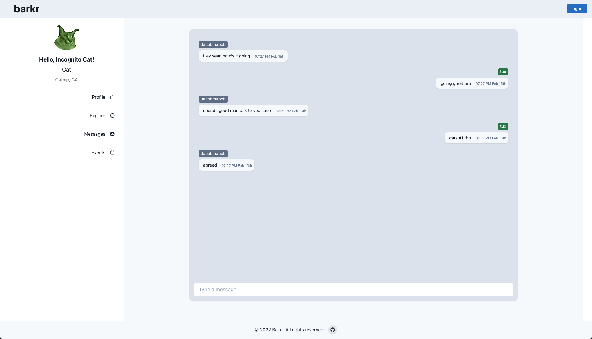
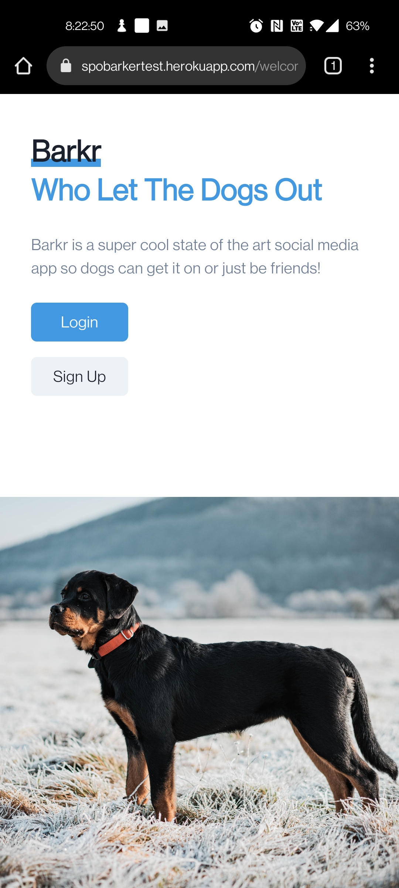
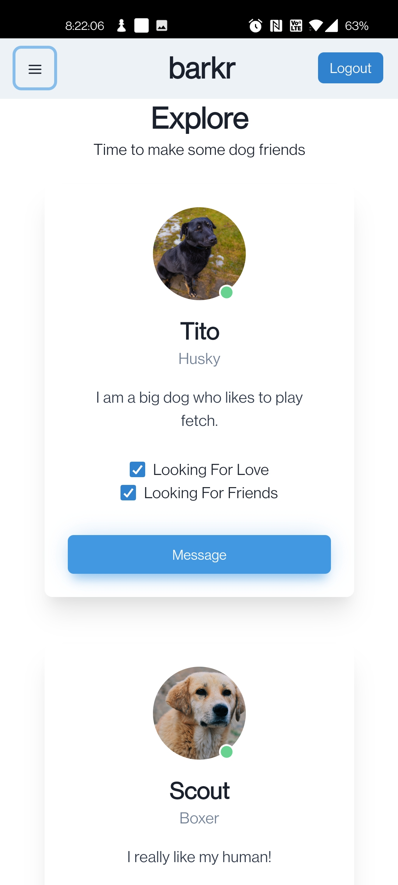
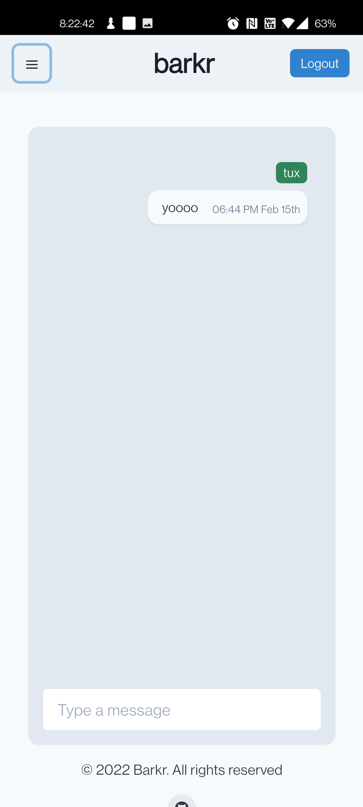

<h1 align="center">Welcome to barkr 👋</h1>
<p>
  
  
  <a href="https://github.com/brOmarito/barkr" target="_blank">
    
  </a>
  <a href="https://opensource.org/licenses/MIT" target="_blank">
    
  </a>
</p>

> BARKr is a unique app we created for the purpose of assisting dog owners in connecting with other dog owners! As of now, we have two categories in which our dog owners can connect. The first category is dog owners looking for dog friends. This way they can set up playdates for their dogs or just a casual walk. The second category is for dog owners who are looking to breed their dog and are looking for other like-minded owners. We tackle this by providing the options as to which category they fall into in their profiles!

### 🏠 [Homepage](https://spobarkertest.herokuapp.com/)

## Screenshots:

## Desktop: 





## Mobile: 





## Prerequisites

- npm 7.x
- MongoDB

## Install

```sh
npm i
```

## Usage

```sh
npm run develop
```

## Authors

👤 **Omar Pacheco, Jacob McCarthy, Josh Elrod, Sean O'Very**

* Github: [@brOmarito](https://github.com/brOmarito)
* Github: [Jacobmabob](https://github.com/Jacobmabob)
* Github: [elrodjosh96](https://github.com/elrodjosh96)
* Github: [@SeanOVery](https://github.com/SeanOVery)

## Show your support

Give a ⭐️  if this project helped you!

## 📝 License

Copyright © 2022 [@brOmarito](https://github.com/brOmarito), [Jacobmabob](https://github.com/Jacobmabob), [elrodjosh96](https://github.com/elrodjosh96), [@SeanOVery](https://github.com/SeanOVery).<br />
This project is [MIT](https://opensource.org/licenses/MIT) licensed.

_